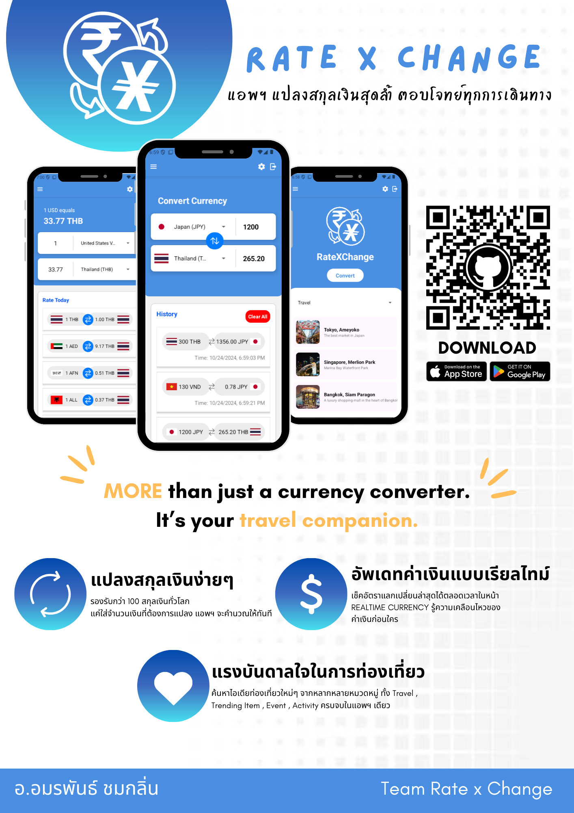

# 🎯 RateXChange Project
RateXChange is a final project for ITE-434 Hybrid Application Development. The propose of this application is to exchange the currencies and recommend places to travel, trending items and activities.

# 🌟 Features
  - ✅ User Authentication (Login, Register) 🔑
  - 💵 Exchange Currency
  - 📜 Exchange history
  - 💎 Real-Time Currency Rate
  - ✈️ Recommending places to travel, trending items and activities
  - 🌐 Language Translation (TH,EN)
    
# Poster

# 🤝 Contributors
<table align="center">
  <tr>
    <td align="center">
      <a href="https://github.com/username">
        
         
        <b>2113110700 Apirak Chimhiran</b>
      </a>
       
      🎉  IT  🎉  
    </td>
     <td align="center">
      <a href="https://github.com/username">
        
         
        <b>2113110957Minthada Lumputtha</b>
      </a>
       
      🚀  IT  🚀
    </td>
     <td align="center">
      <a href="https://github.com/username">
        
         
        <b>2113110668 Supavith Komkam</b>
      </a>
       
       🎉  IT  🎉  
    </td>
     <td align="center">
      <a href="https://github.com/username">
        
         
        <b>2213211861 Pongpai Sodsong</b>
      </a>
       
       🚀  MT  🚀
    </td>
  </tr>
</table>
